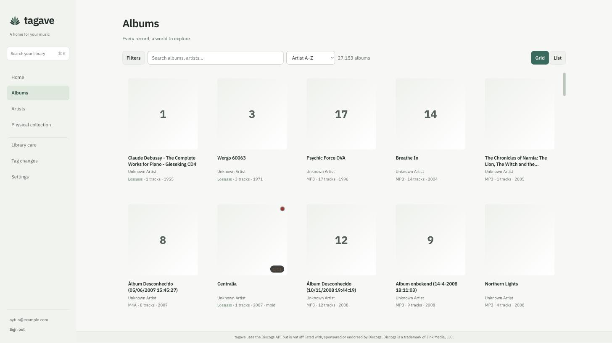

<div align="center">


# tagave

**A catalogue for a music collection you actually own.**

tagave identifies every album in your archive down to the pressing, corrects the
tags without ever damaging a file, and tells you what is missing.

It is not a player. Navidrome, Plexamp and Roon play your music. tagave knows
what it is.

</div>

<br />



<br />

## What it does

**Identifies what you own.** Every album is matched against MusicBrainz and
Discogs, and when the tags are wrong or missing it falls back to acoustic
fingerprinting of the audio itself. It cares which pressing: not just
*Liebe ist für alle da*, but the two-disc edition, with its catalogue number,
and it knows that the folders named CD1 and CD2 are one release.

**Corrects metadata without breaking anything.** Tag changes are proposed as a
plan, previewed file by file, applied, and reversible from a journal. A field
whose correct value is unknown is never blanked. Fields can be locked so nothing
overwrites a decision you made. Files are never converted, never split, never
deleted.

**Tells you what is wrong or missing.** Incomplete albums, duplicates, missing
artwork, and gaps in the discography of artists you follow.

**Knows about the objects on your shelf.** Sync with a Discogs collection and
record which releases you own on vinyl or CD, so the files and the shelf are one
catalogue.

## Quick start

You need Docker and Compose v2.

```sh
cp .env.example .env
openssl rand -hex 32                 # paste this as APP_SECRET
$EDITOR .env                         # also uncomment MUSIC_DIR and point it at your library
docker compose -f docker-compose.prod.yml --profile workers up -d
```

Then open <http://localhost:3100> and follow the setup.

One thing worth knowing before you start: scanning and tag writing happen in a
worker process that has to see your files, which is why `MUSIC_DIR` matters and
why a scan root stays `pending` until a worker is running. [Installation](docs/install.md)
explains the two ways to arrange that.

## Documentation

| | |
|---|---|
| [Installation](docs/install.md) | Getting it running, and connecting it to your music |
| [Features](docs/features.md) | What the app does, in more detail |
| [Tag correction](docs/tag-correction.md) | How writes work, and what stops them going wrong |
| [Operations](docs/operations.md) | Backups, upgrades, health checks, moving workers |
| [Security](docs/security.md) | `APP_SECRET`, rotation, TLS |
| [Architecture](docs/architecture.md) | How the pieces fit, and how to develop on it |
| [Design system](docs/design/system.md) | Visual language and component contracts |

## Status

Early. It runs a real library of about 27,000 albums and 240,000 files every
day, but it has one user, so expect rough edges and read
[Operations](docs/operations.md) before trusting it with anything you cannot
re-rip.

## Licence

[AGPL-3.0](LICENSE). The tag writer runs [mutagen](https://github.com/quodlibet/mutagen)
as a separate process; see [THIRD-PARTY-NOTICES.md](THIRD-PARTY-NOTICES.md).

Metadata comes from [MusicBrainz](https://musicbrainz.org) and
[Discogs](https://www.discogs.com). tagave uses the Discogs API but is not
affiliated with, sponsored or endorsed by Discogs. Discogs is a trademark of
Zink Media, LLC.
