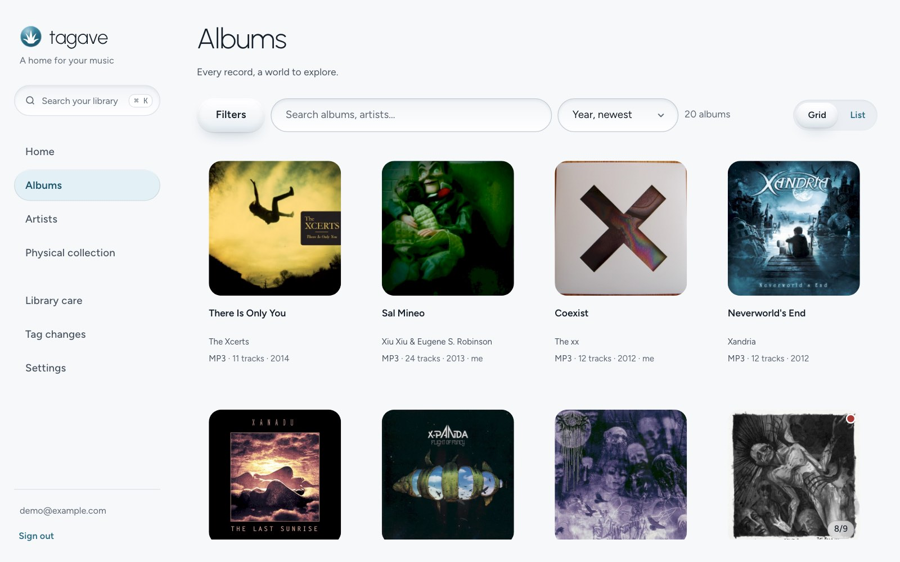

<div align="center">


# tagave

**A catalogue for a music collection you actually own.**

tagave identifies every album in your archive down to the pressing, corrects the
tags without ever damaging a file, and tells you what is missing.

It is not a player. Navidrome, Plexamp and Roon play your music. tagave knows
what it is.

</div>

<br />



<br />

## What it does

**Identifies what you own.** Every album is matched against MusicBrainz and
Discogs, and when the tags are wrong or missing it falls back to acoustic
fingerprinting of the audio itself. It cares which pressing: not just
*Liebe ist für alle da*, but the two-disc edition, with its catalogue number,
and it knows that the folders named CD1 and CD2 are one release.

**Corrects metadata without breaking anything.** Tag changes are proposed as a
plan, previewed file by file, applied, and reversible from a journal. A field
whose correct value is unknown is never blanked. Fields can be locked so nothing
overwrites a decision you made. Files are never converted, never split, never
deleted.

**Tells you what is wrong or missing.** Incomplete albums, duplicates, missing
artwork, and gaps in the discography of artists you follow.

**Knows about the objects on your shelf.** Sync with a Discogs collection and
record which releases you own on vinyl or CD, so the files and the shelf are one
catalogue.

## Quick start

**Prerequisites**: Docker 20.10+ and Docker Compose v2

**Installation** (one command):
```sh
bash -c "$(curl -fsSL https://raw.githubusercontent.com/xooxoxxo/tagave/main/install-tagave.sh)"
```

The installer will:
- Check your prerequisites
- Ask where your music library is located (local path, NFS, or SMB)
- Ask if you want workers on this host or a separate machine
- Generate secrets and configuration
- Start the services

Then open **http://localhost:3100/setup** (or your hostname) and complete the setup wizard.

See [Installation guide](docs/installation.md) for manual setup and [Split topology](docs/split-topology.md) if you want workers on a different host.

## Documentation

| | |
|---|---|
| [Installation](docs/installation.md) | Getting it running, and connecting it to your music |
| [Upgrading](docs/upgrading.md) | Version updates and migrations |
| [Backup & Restore](docs/backup-restore.md) | Database backup strategies and recovery |
| [Split Topology](docs/split-topology.md) | Running workers on a different host |
| [Troubleshooting](docs/troubleshooting.md) | Common issues and how to fix them |
| [Features](docs/features.md) | What the app does, in more detail |
| [Tag correction](docs/tag-correction.md) | How writes work, and what stops them going wrong |
| [Security](docs/security.md) | `APP_SECRET`, rotation, TLS |
| [Architecture](docs/architecture.md) | How the pieces fit, and how to develop on it |
| [Design system](docs/design/system.md) | Visual language and component contracts |

## Status

Early. It runs a real library of about 27,000 albums and 240,000 files every
day, but it has one user, so expect rough edges and read
[Operations](docs/operations.md) before trusting it with anything you cannot
re-rip.

## Licence

[AGPL-3.0](LICENSE). The tag writer runs [mutagen](https://github.com/quodlibet/mutagen)
as a separate process; see [THIRD-PARTY-NOTICES.md](THIRD-PARTY-NOTICES.md).

Metadata comes from [MusicBrainz](https://musicbrainz.org) and
[Discogs](https://www.discogs.com). tagave uses the Discogs API but is not
affiliated with, sponsored or endorsed by Discogs. Discogs is a trademark of
Zink Media, LLC.
